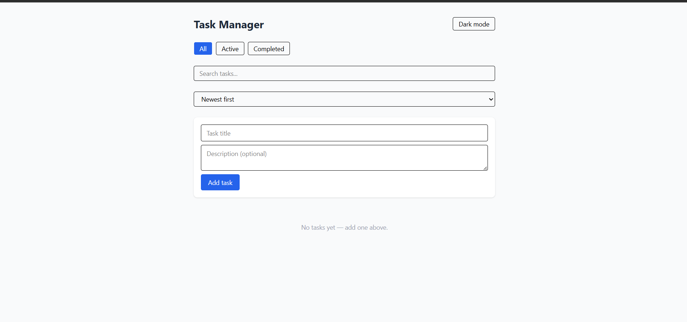
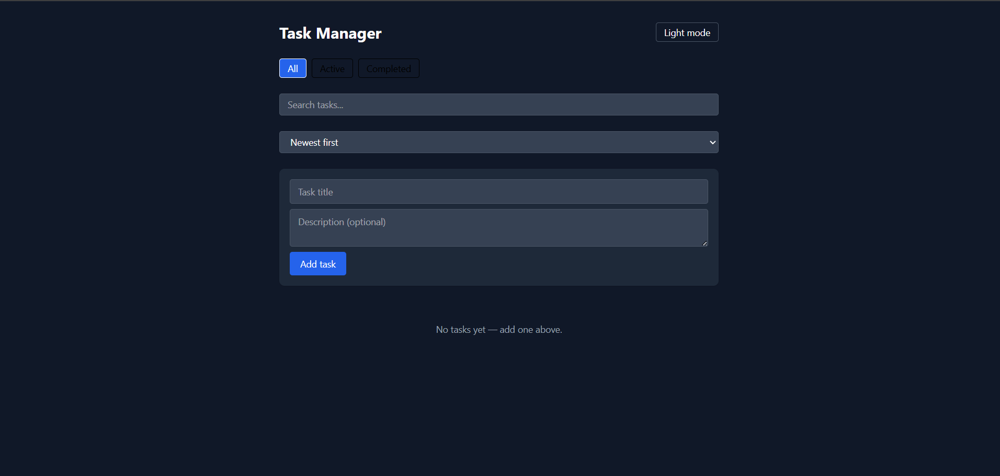
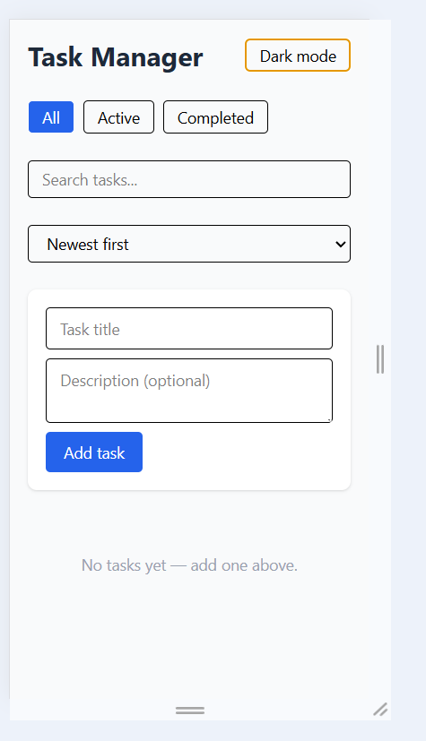

# Task Manager

A personal task manager built with React, Tailwind CSS, and localStorage.

## Features

- Add tasks with a title and optional description
- Mark tasks complete or incomplete
- Edit tasks inline by clicking the title
- Delete tasks with a confirmation prompt
- Filter by All / Active / Completed
- Search tasks by title
- Sort by newest first or alphabetically
- Dark / light theme toggle, remembered across visits
- Tasks persist in the browser using localStorage
- Error boundary so a crash shows a recovery message instead of a blank page

## Tech stack

- React (functional components + hooks)
- Vite
- Tailwind CSS

### Custom hooks

- useLocalStorage - syncs state with localStorage, handles missing or corrupted data
- useTasks - owns task state and filtering/searching/sorting logic
- useTheme - persists dark/light mode choice

## Getting started

Run npm install then npm run dev, and open the local URL shown in the terminal.

## Known issues / limitations

- Tasks are stored per-browser, no account system or sync across devices
- No due dates, tags, or drag-and-drop reordering yet

## Future enhancements

- Due dates and priority levels
- Drag-and-drop reordering
- Tags/categories
- Export to JSON/CSV
## Screenshots

### Light mode

### Dark mode

### Mobile view

# Task Manager

**Live demo:** https://task-manager-khaki-kappa-18.vercel.app/
**Repository:** https://github.com/ReemHaze/task-manager